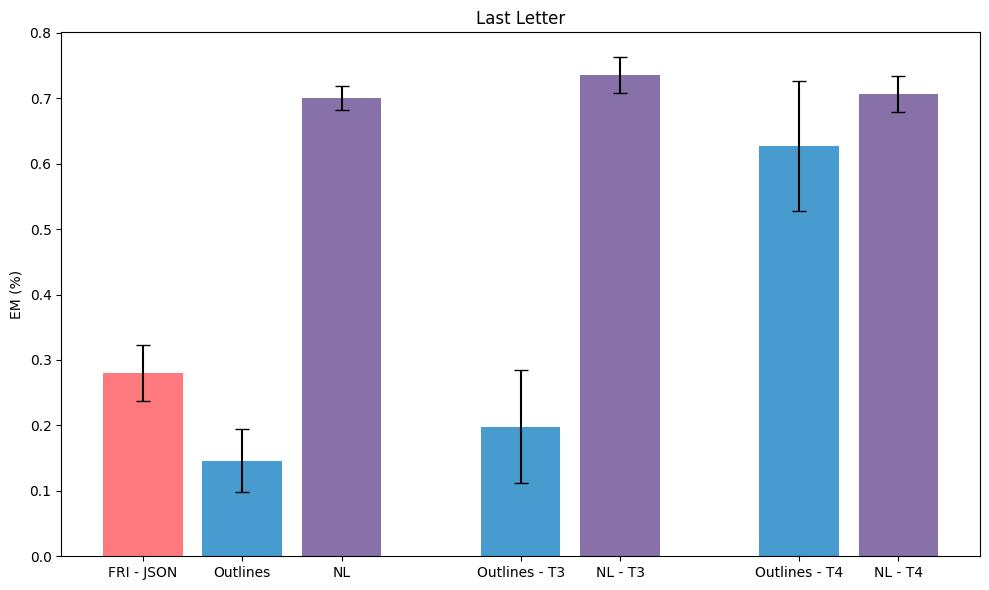
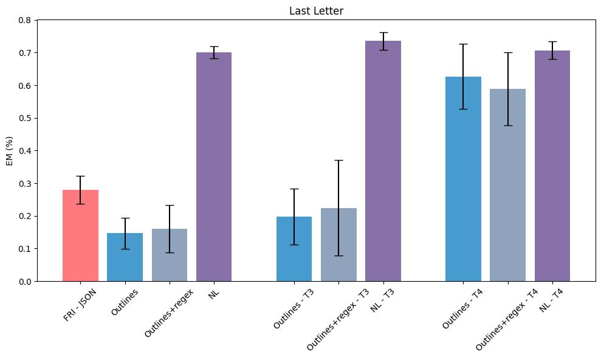

# Say what I mean

Since the release of "[Let Me Speak Freely? A Study on the Impact of Format Restrictions on Performance of Large Language Models](https://aclanthology.org/2024.emnlp-industry.91/)," which was accepted by the EMNLP 2024 conference for its Industry Track, we have received a range of feedback reflecting diverse perspectives from experts in the research field and the broader community. So we would like to take this opportunity to revisit the rationale behind our experimental settings as well as address some of the concerns raised.

## Experiment Designs and Thought Process

We would like to take this opportunity to explain our experimental design and thought process.

1. We manually wrote 3 task descriptions for each task and 3 format descriptions for each format type. This resulted in 9 prompts which we used to evaluate the impact of different formats and whether this impact remains consistent across different LLM families.

2. As we were evaluating a wide variety of models with different response styles (heavy markdown or plain text), we wrote our prompts as generic as possible such that they are not optimise to any specific LLMs to achieve their best performance. Instead, we simply ensured each task was evaluated using different prompts to simulate average LLM performance. One crucial metric we were interested in was the variance of downstream performance metrics across different prompts.

3. Regarding our prompt strategy, we decided to use zero-shot chain of thought as it is currently the most common evaluation strategy used by major LLM providers such as [Anthropic](https://www.anthropic.com/claude/haiku) and [OpenAI](https://openai.com/index/gpt-4o-system-card).

4. In total, we conducted our experiments on 5 LLMs, each prompted in 9 different ways to respond in 6 different formats (JSON-mode, JSON, YAML, XML, Natural language, NL-to-JSON: 2-stage), which resulted in **270 full experiments**. We did not take shortcuts by evaluating only a subset of given tasks, so for large test sets such as GSM8K, it took us considerable time to complete.

Here are the reasons why we invested such effort in the prompts:

1. We began with a hypothesis that instructing an LLM to perform multiple tasks (reasoning + output in JSON) would inherently impact performance more than completing each task individually. During the decoding process, we theorised that adding certain tokens such as "{" might create a bias on subsequent tokens, potentially guiding the task towards domains incompatible with the additional tasks in the instruction (in this case, reasoning).

2. We started with a simple prompt and found responses in simple JSON format performed worse than natural language on temperature 0 greedy decoding (no structure generation). However, when evaluating other formats such as YAML and XML, we found they could sometimes perform better than natural language.

3. Therefore, to determine whether adding formatted responses on top of LLMs would impact performance, we needed to evaluate each task across all formats using various prompts. Otherwise, our written prompts would have been biased towards the best-performing format.

Without this prior knowledge, it would have been easy to reach premature conclusions or become confused about our decisions.

## Rebuttal
We would also like to address points raised in '[Say What You Mean](https://blog.dottxt.co/say-what-you-mean.html),' which differ from our conclusion about the impact of adding format on reasoning, rooted in rigorous experimental settings and aligned with established research standards


> 1. The paper itself finds that structured generation has superior performance on a number of classification tasks.

In our paper, we explained that classification tasks perform better because they primarily evaluate the parametric knowledge of LLMs. Adding reasoning capabilities on top would not yield significantly higher scores, as the answers are already encoded in the model weights themselves.

To put it plainly: "We hypothesise that JSON-mode improves classification task performance by constraining possible answers, thus reducing errors in answer selection. Conversely, natural language responses may introduce distractions, leading to parsing errors. These findings suggest that the impact of format restrictions on LLM performance is task-dependent: stringent formats may hinder reasoning-intensive tasks but enhance accuracy in classification tasks requiring structured outputs."

> 2. The prompts used for unstructured (NL) generation are markedly different than the ones used for structured generation, so the comparisons are not apples-to-apples to begin with.

In our evaluation design, we structured each task to contain two sections: task description and format instruction. Both structured and unstructured formats were evaluated using the same set of three task descriptions (shown in the t<number> of the file mentioned in author's blog). The only difference lies in the format instruction, which necessarily varied to enable comparison between natural language text and structured formats (JSON, XML, YAML).

For example, here is the prompt difference between natural language prompt (written by us) and JSON prompt (written by blog's author) which was used in the blog.

**Natural language prompt (1-shot CoT):**

```markdown
<|begin_of_text|><|start_header_id|>user<|end_header_id|>

Follow the instruction to complete the task:
String manipulation task:
• Given: A sequence of words
• Required: A new string made from the last letter of each word
• Process: Think step by step to solve this challenge
Note: Ensure you've read the question thoroughly before beginning.


Instruct : Provide your output in the following text format:
Answer: <think step by step>. The final answer is <answer>


Here are some examples:
Question: Take the last letters of the words in "Elon Musk" and concatenate them.
Answer: The last letter of "Elon" is "n". The last letter of "Musk" is "k". Concatenating them is "nk".. The answer is nk.
Question: Take the last letters of each words in "Camilo Becky Eliza Rebecca" and concatenate them.<|eot_id|><|start_header_id|>assistant<|end_header_id|>

```

**JSON prompt (1-shot CoT):**

```markdown
<|begin_of_text|><|start_header_id|>system<|end_header_id|>

You are an expert in solving simple word puzzles using reasoning steps. Your specific
task is going to be to take a list of 4 names and reason about the last letter of each .,
then you will concatenate those letters into a word. The Question will be plaintest from the user
and response will be formatted as JSON below:

{"reasoning": <reasoning about the answer>, "answer": <final answer>}<|eot_id|><|start_header_id|>user<|end_header_id|>

Question: Take the last letters of each words in 'Ian Peter Bernard Stephen' and concatenate them.<|eot_id|><|start_header_id|>assistant<|end_header_id|>

{"reasoning": "The last letter of 'Ian' is 'N', the last letter of 'Peter' is 'R', the last letter of 'Bernard' is 'D', and the last letter of 'Stephen' is 'N'. Therefore, the answer is 'NRDN'.", "answer": "NRDN"}<|eot_id|><|start_header_id|>user<|end_header_id|>

Question: Take the last letters of each words in "Britt Tamara Elvis Nayeli" and concatenate them.",<|eot_id|><|start_header_id|>assistant<|end_header_id|>
```

Unlike their results which only report on one prompts as we will report later is not enough because it contains noise which would create very different results.

> 3. The structured generation prompts do not provide the model with adequate information to solve the task, this leads to particularly poor performance for the ‘json-mode’ examples.

This appears to reference issue #2, where the author claims we did not include adequate information to solve the task. In fact, we did include the JSON schema in our source code in the form of tool-use (which was the only way of outputting JSON using the text-generation-inference engine at the time). The [schema was provided as function call parameters](https://github.com/appier-research/structure-gen/blob/main/tasks/lastletter.py#L129), which the inference engine adds to the prompt before calling the LLM. This schema definition for the last letter task was passed as a tool into the downstream API calls in [the backend service](https://github.com/huggingface/text-generation-inference/blob/main/router/src/lib.rs#L957).

Last letter function call definition:

```json
schema = {
            "type": "function",
            "function": {
                "name": "get_reasoning_answer",
                "description": "Answer to the last question",
                "parameters": {
                    "type": "object",
                    "properties": {
                        "reason": {
                            "type": "string",
                            "description": "think step by step when going through last letter of each words"
                        },
                        "final_answer": {
                            "type": "string",
                            "description": "final answer in lower case alphabet"
                        }
                    },
                    "required": ["reason", "final_answer"]
                }
            }
        }
```
Tool call in our source code: https://github.com/appier-research/structure-gen/blob/main/llms/oai_structure.py#L19 

> 4. The real meat of the paper is actually about parsing the results of one LLM with a second LLM. The authors refer to this as the “Perfect Text Parser”, we will refer to it as the “AI parser” (for reasons we'll clarify soon).

We use the term "perfect text parser" simply because it offers greater versatility in handling unknown responses prior to benchmarking. Without knowing what kinds of outputs these LLMs might produce (which is necessary for writing "flexible regex"), we determined that using another LLM to extract the answer was the most effective parsing method. This was common practice before our work and was first implemented (to our knowledge) in "Large Language Models are Zero-Shot Reasoners".

Again due to the use of different prompts in different response format, writing regex to handle each edge cases for each LLMs in different formats is not practical due to limited time and human resource.

> 5. The paper confuses structured generation with JSON-mode1, although independent runs of these evals show that “JSON-mode” yields better results than unstructured generation.

We have not confused structured generation with JSON-mode. In our paper, JSON-mode refers to documentation we found from various API providers explaining how to obtain structured output (which typically happens to be JSON). To our knowledge, OpenAI first coined the term "JSON-mode", which others subsequently adopted.

* OpenAI (at the time of experiment, we only have function call to use generate low error rate json object) : https://platform.openai.com/docs/guides/structured-outputs#json-mode

* Anthropic : https://docs.anthropic.com/en/docs/test-and-evaluate/strengthen-guardrails/increase-consistency 

* Gemini : https://ai.google.dev/gemini-api/docs/structured-output?lang=python 


## Small problem with negative critique:

When reviewing the source code used in the critique , we found the following discrepancy with our paper main setting:

1. Prompt differences: we found the prompt used to evaluate NL was different than the later JSON format.

2. Additional parsing limitations added in outlines code wasn’t available to LLM in any of our task descriptions, such as max characters on reasoning, limit the answer to 4 characters.

Side note : when selecting the in context examples,  we purposefully select 2 words name as example to test the generalization ability of LLM on 4 words name. ( Following the idea of Jason Wei et al 2022 )

**Prompt differences:**

When comparing last letter concatenation, outlines experiment was based on a new task description prompt, where we called it task description #4 (T4).

```
You are an expert in solving simple word puzzles using reasoning steps. Your specific
task is going to be to take a list of 4 names and reason about the last letter of each .,
then you will concatenate those letters into a word. The Question will be plaintest from the user
and response will be formatted as ...<format description>
```

And there's the task description #3 prompt which was used as NL comparison in original blog (Fig 5, 6, 7, 8):

```
Follow the instruction to complete the task:
String manipulation task:
• Given: A sequence of words
• Required: A new string made from the last letter of each word
• Process: Think step by step to solve this challenge
Note: Ensure you've read the question thoroughly before beginning.
```

The blog post authors reran our experiments on 1-shot CoT setting, which we did not report in our paper because we found in general its worse than 0-shot CoT. This worse result might be due to how the chain of thought was constructed as well as the use of only 2 words concatenation instead of 4 words. Including this incomplete result introduces additional impact element (ICL component) which makes our experiments result even more noisy and irrelevant. Future work might be able to explore how ICL formats impact downstream performance.

| Last Letter Llama 3 Instruct | 0-shot CoT | 1-shot CoT (used in blog) | Blog author's reported best : JSON (struct) 1-shot CoT |
|-------------|------------|------------|--------|
| lastletter-t3-f3 | **78.00*** | 57.33* | 77.00 (T4-F1) |
| Average of 9 prompts | 70.07* | 44.64* | - |

*scores reported from using ai answer parser.

We also included the best scores reported in blog article which uses the T4-F1 (task description #4, format description #1) prompt combination.

Here we show that simply picking a single prompt or setting cannot be compared as both results can be noisy and bad.

**Additional parsing limitations:**

We decided to benchmark on a limited sets of libraries which support grammar parameter inference and found this is the most crucial element as removing this constraint resulted in large degradation in scores. In order to be compatible with other LLM family such as Anthropic, Gemini, we decide not to add these limitation in order to make the result comparable with these models.

These are the format schema(description) we used in outlines structure generation, we also include other 2 schemas by swapping the `reason` field name to `step_by_step_reasoning` and `think_step_by_step` to match our other 2 format description.

```python
class LastLetterStructureV1(BaseModel):
    """
    Format description:
    Provide your output in the following valid JSON format:
    ```json
    {
        "reason": ...,
        "answer": ...
    }
    ```
    """
    reason: str # constr(max_length=300)
    answer: str # str = Field(pattern=r'[A-Za-z]{4}')
```

We will use the same schema restriction (reason max character of 300 and answer to be 4 character) when comparing between no restriction and restriction on answer space.

We refer the JSON (unstruct) as the schema without schema restriction as Outlines JSON and JSON (struct) as Outlines JSON+regex in our experiments.

**Experiments**

To answer which component contributed the improvement, we conduct an extensive ablation experiments by evaluating based on 0-shot CoT setting. We use outlines version 0.1.6 and [JSON structure generation notebook code](https://github.com/dottxt-ai/demos/blob/main/say-what-you-mean/JSON_section.ipynb) in our experiments.

1. Impact of prompt differences



On the first section to the left, we showed that rerunning the same 9 0-shot prompts results in a worst scores than reported by outlines blog. We rerun the same task description T3 on outlines found better results. However its still huge gap compare to natural language (NL). Hence we also rerun both experiments and found prompt was the major improvement here. 

Note for T3 and T4 results, we only average over 3 different format description, so they are not really comparable with the first section.

1. Does schema restriction matters?

Adding schema restriction (max reasoning string length, limited answer regex pattern) during structure generation we found minor improvement in final results. However standard deviation seems to widen in the final results.



The full stats can be found as below:

| Method | Mean | Std | Standard Error |
|---------|------|-----|----------------|
| FRI - JSON | 0.28 | 0.13 | 0.04 |
| Outlines JSON | 0.15 | 0.20 | 0.05 |
| Outlines JSON+regex | 0.16 | 0.22 | 0.07 |
| NL | 0.70 | 0.06 | 0.02 |
| Outlines JSON- T3 | 0.20 | 0.21 | 0.09 |
| Outlines JSON+regex - T3 | 0.22 | 0.25 | 0.15 |
| NL - T3 | 0.74 | 0.05 | 0.03 |
| Outlines JSON - T4 | 0.63 | 0.24 | 0.10 |
| Outlines JSON+regex - T4 | 0.59 | 0.19 | 0.11 |
| NL - T4 | 0.71 | 0.05 | 0.03 |

**Look at the data**

Looking at Outlines JSON+regex we found that LLaMA 3 8B Instruct wasn't able to generate proper reasoning in the reasoning field without in-context examples in this following task description:

```markdown
You are given a string of words and you need to take the last letter of each words and concate them.
Read the last question carefully and think step by step before answering. 
```

Outlines JSON+regex simply can't breakdown the last character of each words in the reason field.

```markdown
{"reason":"Concatenating the last letters of each word in the given string","answer":"oaoa"}
```

However this is not an issue in natural language.

```markdown
Answer: The problem requires taking the last letter of each word in the given string "Camilo Becky Eliza Rebecca" and concatenating them. 

1. Last letter of "Camilo" is O.
2. Last letter of "Becky" is Y.
3. Last letter of "Eliza" is A.
4. Last letter of "Rebecca" is A.

The final answer is OYAA.
```

Format restricting instruction in JSON (FRI - JSON):
~~~markdown
Here is my answer:

```json
{
    "reason": "We take the last letters of each word and concatenate them. The words are 'Camilo', 'Becky', 'Eliza', 'Rebecca'. The last letters are 'O', 'Y', 'A', 'A'. We concatenate them to get 'OYAA'.",
    "answer": "OYAA"
}
```

I hope this is the expected format! Let me know if I made any mistake.
~~~

Note this is the first example found in last letter test set.

## Conclusion:

We are deeply appreciative of the attention our work has garnered from academia, industry, and the community. All constructive feedback can potentially serve as a catalyst for greater clarity from a scientific perspective. We strongly believe in open science, which is why we released not only our experimental code but also all of our experimental results. This commitment is reflected in our thorough experimental process (involving multiple models from different institutes and multiple datasets), from design and execution through to analysis and reporting (including averages and variances from different prompts).

While we welcome counter-arguments regarding our conclusion about whether adding restrictions impacts reasoning, we must emphasise that in academic circles, there is still ongoing debate about whether LLMs can reason at all. Both sides of this debate provide substantial evidence and ablation experiments to support their positions on whether LLMs can or cannot reason. We hope that similar rigorous discussion can be conducted regarding the impact of structured generation on reasoning, supported by thorough experimental evidence and systematic analysis.
